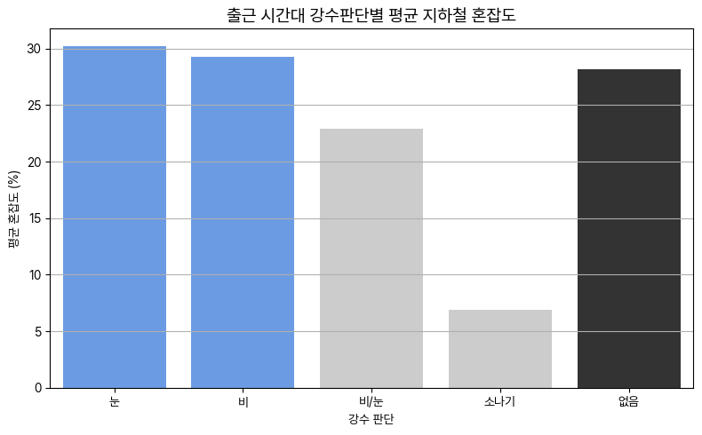

# ☔ 강수 판단 별별 지하철 혼잡도 분석

### 📁 파일 설명

- `pty_obs.ipynb`: 비, 눈, 무강수 등 **강수 형태에 따른 지하철 혼잡도 변화**를 분석한 노트북입니다.

---

### 🎯 분석 목적

- 날씨 중에서도 특히 강수 조건이 지하철 이용 패턴에 미치는 영향을 파악하고자 함
- **강수 형태별(PPTY) 혼잡도 평균 차이**, **시간대/계절별 영향력** 등을 비교하여,
- **비 오는 날과 눈 오는 날의 혼잡도 증가 현상**을 정량적으로 분석합니다.

---

### 🔍 주요 분석 내용

- PTY 변수 기반 강수 구분 (없음 / 비 / 눈 / 비+눈)
- 혼잡도 데이터와 기상 데이터 병합
- 강수 유무에 따른 전체 평균 혼잡도 비교
- 요일, 시간대, 계절 변수와 함께 **교차 분석**
- 시각화: boxplot, bar chart, 시간별 분포 그래프 등

---

### 🖼️ 시각화 예시

- **강수 형태별 시간대 혼잡도 평균**

---

### 🌧️ 분석 조건

- 기온/체감온도/습도 외 기상 변수는 제외
- 하루 단위로 예보된 PTY 기준 적용
- 혼잡도 데이터는 2021~2023년 전처리된 결과 활용

---

### 📎 관련 전처리 경로

- 혼잡도: `preprocess/Congestion_preprocess/`
- 예보 TMP/PTY 등: `preprocess/forecast/`
