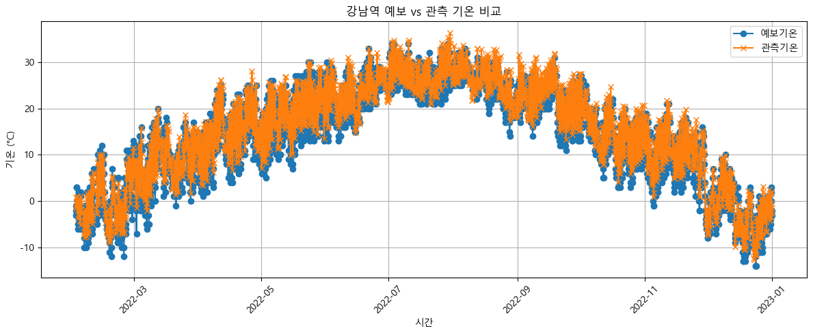

# 🌤️ 기상 예보 vs 기상 관측 비교 분석

### 📁 파일 설명

- `forecast_observe_ver.ipynb`: 기상청 단기예보 데이터와 실측 관측 데이터를 비교하여, **예보 정확도와 오차의 공간·시간적 특성**을 분석한 노트북입니다.

---

### 🎯 분석 목적

- 기상청에서 제공하는 **격자 기반 단기예보**와
- 기상 관측소에서 측정한 **실제 기온(TMP)** 값을 비교함으로써,
- **예보의 정확도(MAE, RMSE 등)를 평가**하고,
- 예보와 관측 간의 오차가 **지리적 거리 또는 시간대별로 어떤 차이를 보이는지** 분석합니다.

---

### 🔍 주요 분석 내용

- 예보 데이터와 관측 데이터 병합 (datetime + 위치 기준)
- 단일 지점 비교: 예보 TMP vs 관측 TMP
- 전 지점 평균: 전체 격자 기반 예보 vs 관측소 측정 TMP
- MAE, RMSE 계산
- 관측소-지하철역 간 거리별 오차 분포 시각화
- 시계열 예보-관측 비교 그래프

---
### 🖼️ 시각화 예시

- 아래 이미지는 예보 TMP와 관측 TMP를 시간 순으로 비교한 결과입니다.

- 예보와 실제 관측 간 오차가 시계열 또는 거리 기반으로 어떤 차이를 보이는지 시각적으로 확인할 수 있습니다.
---
### 📊 사용 변수

- TMP (기온)
- datetime
- nx, ny (격자 좌표)
- 관측소 번호 (stn) 또는 위도/경도 기반 거리

---

### 📎 관련 전처리 경로

- 예보 데이터: `preprocess/forecast/`
- 관측 데이터: `data/raw/관측/`
- 혼합 위치 매핑: `nx_ny_to_위경도.csv`

