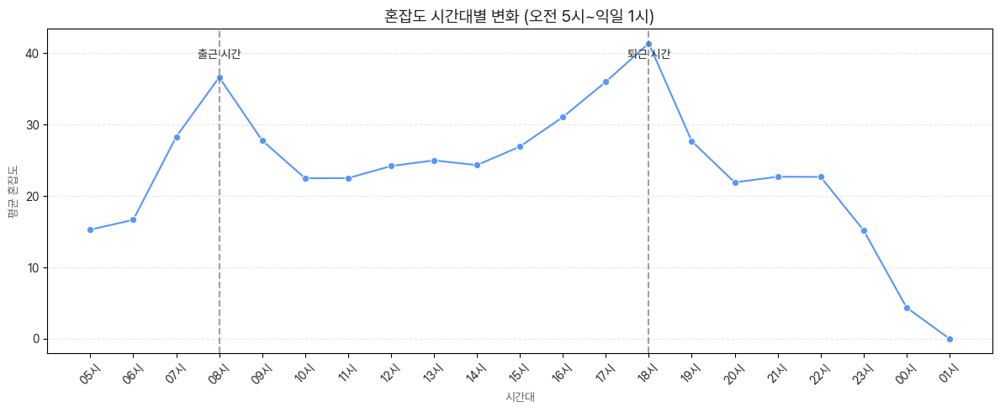

# ⏰ 시간 요소별 지하철 혼잡도 분석

### 📁 파일 설명

- `time_obs.ipynb`: **요일, 시간대, 계절** 등 시간 요소가 지하철 혼잡도에 어떤 영향을 주는지 분석한 노트북입니다.

---

### 🎯 분석 목적

- 지하철 혼잡도는 시간대와 요일, 계절에 따라 명확한 **패턴을 보이는지** 파악
- 이를 통해 **출근/퇴근 시간, 주중/주말, 계절성**의 영향을 수치화하고 시각적으로 설명

---

### 🔍 주요 분석 내용

- **요일별 혼잡도 평균**: 월~일 평균값 비교
- **시간대별 혼잡도 분포**: 하루 24시간 기준, 시간대별 승차량 변화 추이
- **계절별 혼잡도 변화**: 봄/여름/가을/겨울 구간별 혼잡도 평균 비교
- **시각화**: heatmap, line plot, bar chart 활용

---

### 🖼️ 시각화 예시

- **요일 × 시간대 히트맵**

---

### 📎 관련 전처리 경로

- 혼잡도: `preprocess/Congestion_preprocess/`
- 시간 요소 가공: `datetime` → `year`, `month`, `day`, `hour`, `season`, `weekday` 파생
