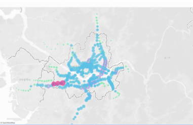

# 🚇 지하철 혼잡도 위치기반 시각화

### 📁 파일 설명

- `congestion.twb`: 서울시 지하철역별 혼잡도 분포를 Tableau로 시각화한 파일입니다.

### 📍 시각화 목적

- 각 지하철역의 위도/경도 기반 위치 데이터를 활용하여,
- **서울 전역의 혼잡도 수준을 지도 위에 직관적으로 표현**합니다.
- 시간대별 평균값을 집계하여 **하루 중 혼잡한 구간, 역 위치 분포 등 인사이트를 도출**합니다.

---
### 🖼️ 시각화 예시

- 예보와 실제 관측 간 오차가 시계열 또는 거리 기반으로 어떤 차이를 보이는지 시각적으로 확인할 수 있습니다.

---
### 🔍 주요 시각화 요소

- 배경 지도: Tableau 기본 지도 사용
- 시각화 대상:
  - 평균 혼잡도 (`congestion`) 값을 색상 or 원 크기로 표현
  - 혼잡도가 높은 상위 역 하이라이팅
- 필터: 시간대, 요일 등 조건별 필터 구성 가능

### 📈 사용 데이터

- 혼잡도 전처리 결과(`yearly_congestion[2021~2023]`)를 기반으로 집계한 결과
- `station_name`, `latitude`, `longitude`, `congestion` 컬럼 포함

### 📎 관련 전처리 경로

- `preprocess/Congestion_preprocess/`
